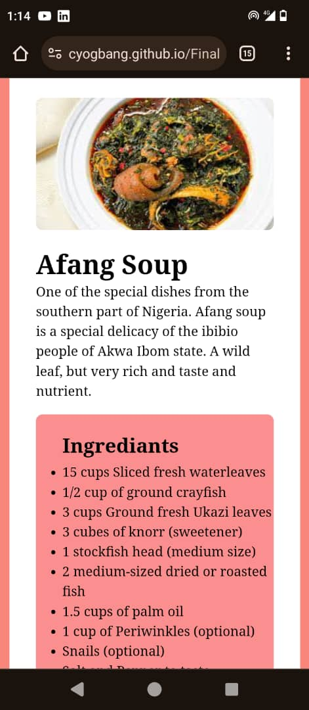
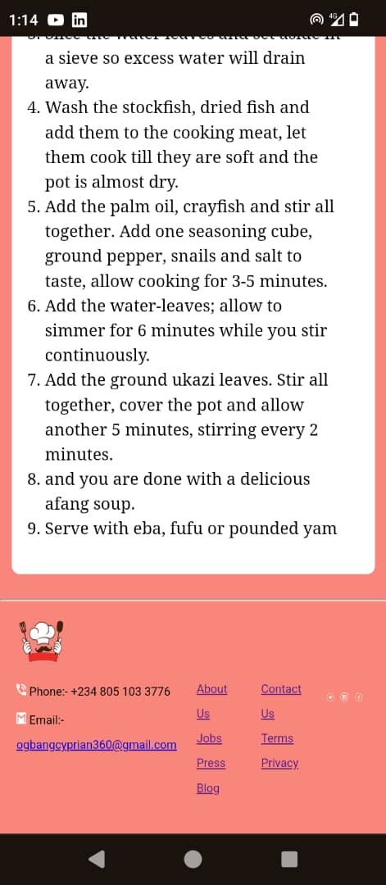

# FOOD RECIPE PAGE FOR NEW CHEFF
## This page is divided into many sections for easy usage
-The first **Top container** is further sections into registration, and photo gallery
see sample image bellow

-The second **Bottom container** contains a recipe search section and a photo scroll bar
of all available recipe on the page
see sample image bellow

-The Third **Recipe Page** by defaul, is hidden inside the page. It contains individual
recipes with description, ingrediant and preparation method.
*To access search for recipe, or click on the recipe image*
see sample image bellow

-The footer contains social media link to a dommy account page